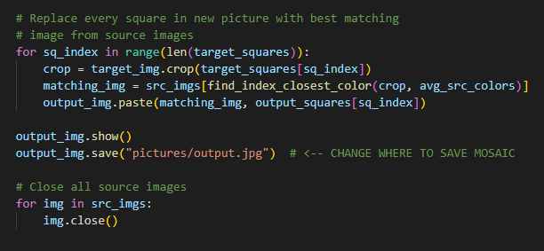

# photo-mosaic

## Description

Creates a photographic mosaic of any user inputted photo out of any number of user
inputted "source" images. The user can change the size/quality of the source images,
although currently the program only works if the source images are made to be squares.
The user can also change the minimum number of source image rows that will make up the target image,
which allows some measure of control over the quality of the outputted photo mosaic.
When a minimum number of rows is chosen, the program will output a photo with as close to
that minimum number as possible while ensuring that as much of the target photo is outputted as
possible. After the image is created, it will be saved to a directory and name of the user's choosing.

### Example

#### Input

#### Output

## Installation

To install the project, run `python pip install -r requirements.txt` from the project directory.

## Usage

1. Choose a target image and source images to use for the mosaic.

2. Open resize.py in a text editor of your choosing and configure it so it resizes your source images to your liking.  
  
Here, near the top of the file, you can change whether the old sized images are deleted by changing the DELETE boolean, if this is not your first time running the script.
You can also change the size you wish to make your source images. This is mainly to control how detailed the source images will be when you
zoom in on the outputted mosaic. Currently, the photomosaic only supports square source images, so make sure the HEIGHT field stays equal to WIDTH.
Also, make sure that the size you choose is smaller than the width and height of all of your source images for the best results.
Keep in mind that larger source images will result in a much larger mosaic file size in the end.  
  
Here, in the main() function, you can change what directory the old sized images are in (at the first file path shown in the image), what directory the source images to
be resized are in (the second file path shown), and what directory the new, sized images will be output to (the last file path shown).

3. Once you have configured everything to your liking, run `python resize.py` from the project directory to run the script and generate your sized images.

4. Open mosaic.py in a text editor of your choosing and configure it to your liking.

Here, near the top of the file, you can change the directory and name of the image to be made into a photo mosaic. Next, change the directory
where the source images are located. Make sure this is the directory where the sized images generated in the last step are located. Finally, change
the minimum desired number of rows to a number of your choosing. This can be thought of as the quality of the outputted mosaic since each source image
acts as a pixel does in a normal image (e.g. 144 Rows of source images outputs a mosaic that looks similar in quality to a normal image of 144p).
Here, keep in mind that while 144 rows may correspond to 144p, your actual mosaic file size will likely be much greater than that since it is made up
of lots of smaller images, and not pixels.  
  
Here, near the bottom of the main() function, you can change what directory the outputted mosaic will save in and what name it will save as.
Make sure to keep the file extension as .jpg.

5. Once you have configured everything to your liking, run `python mosaic.py` from the project directory to create your photo mosaic!
